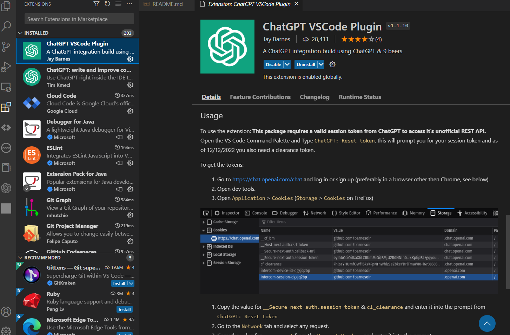
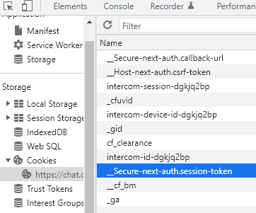

# MyChatGPT

My ChatGPT

## My API Key

[OpenAI API key](https://beta.openai.com/account/api-keys)

## Integrate to VSCode

To get the tokens:

Go to <https://chat.openai.com/chat> and log in or sign up (preferably in a browser other then Chrome, see below).

Open dev tools.

Open Application > Cookies (Storage > Cookies on FireFox)

__Secure-next-auth.session-token

cf_clearance

user-agent

To use the extension:

Open the VS Code Command Palette and Type ChatGPT: Reset token, this will prompt you for your session token and as of 12/12/2022 you also need a clearance token.

## Integrate to IntelliJ

...
